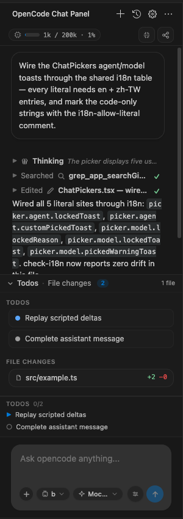
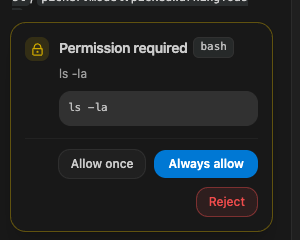
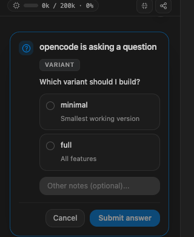
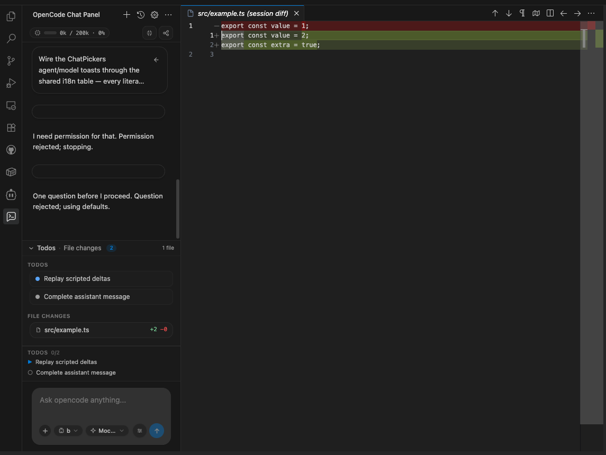
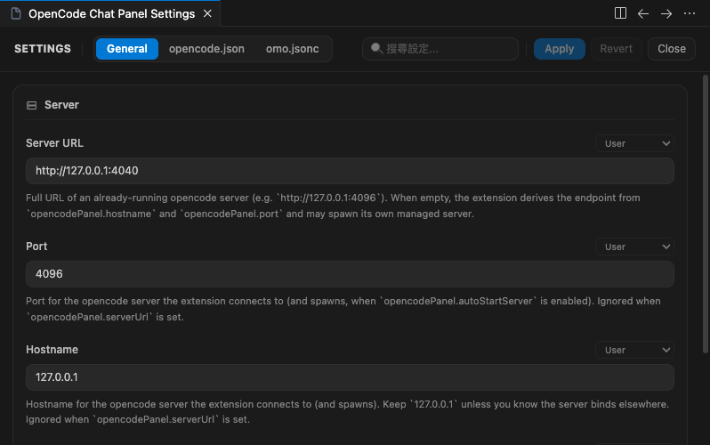
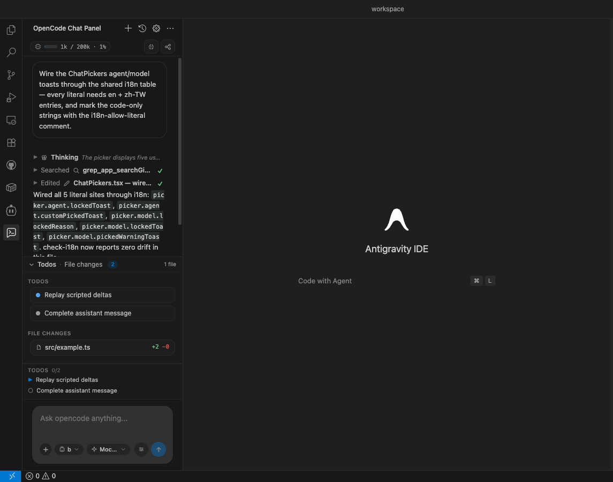

# Chat Sidebar for OpenCode

English · [繁體中文](README.zh-TW.md)

[](https://github.com/SenCha930511/chat-sidebar-for-opencode/blob/main/LICENSE)
[](https://github.com/SenCha930511/chat-sidebar-for-opencode/releases)
[](https://marketplace.visualstudio.com/items?itemName=SenCha930511.chat-sidebar-for-opencode)
[](https://github.com/SenCha930511/chat-sidebar-for-opencode/stargazers)

A sidebar chat extension for VS Code that drives your **locally installed
[opencode](https://opencode.ai)** through its official headless server —
a Codex/Cursor-grade GUI chat panel without leaving your editor.

- Multi-session chat with real-time streaming responses
- Permission approvals and question cards inline in the conversation
- Slash-command palette, agent picker, and model picker
- `@`-mention file attachments, image paste, editor-selection attach
- Todos and session diffs dock with native `vscode.diff` previews
- Bilingual UI (English / 繁體中文) that follows VS Code's display language,
  with an in-app override (`opencodeChatSidebar.language`) that hot-swaps every
  open panel without a reload

The extension talks to opencode's own server (HTTP + SSE) through the official
`@opencode-ai/sdk`, all traffic proxied by the extension host — no browser
security workarounds, no provider keys stored by the extension.

---

## Features

- **Sessions** — list, create, rename, delete, search, share/unshare, and fork
  sessions. Session state syncs automatically over the server event stream.
  The panel is chat-first: the conversation owns the sidebar by default, and
  the header history button slides the session list in as a left drawer (Esc,
  backdrop click, or picking/creating a session closes it). The sidebar also
  stacks a native **Sessions** view below Chat that shows the session list on
  its own and can be collapsed by the editor.
- **Streaming chat** — markdown rendering with syntax highlighting, collapsed
  reasoning ("Thinking") parts, and generic tool-call cards that render *any*
  tool name data-driven (built-in or custom).
- **Composer** — Enter to send, Shift+Enter for newline, per-session drafts,
  Stop/abort while busy, text + image + `@`-mention file attachments, and a
  warn-before-send flag on sensitive paths (`.env`, `*.pem`, `id_rsa`, …).
- **Slash commands & pickers** — type `/` for the command palette (opencode
  builtins *and* custom commands), pick your agent and model per session.
- **Approvals** — permission cards (allow once / always allow / reject) and
  question cards appear inline; nothing is auto-answered.
- **Todos & diffs dock** — the session's todo list and per-message file diffs,
  opened in VS Code's native diff editor.
- **Message ops** — revert (with confirmation), unrevert, regenerate,
  summarize/compact, run a shell command, export transcripts as markdown.
- **Token usage strip** — per-session totals of assistant
  input/output/reasoning tokens shown in the chat toolbar (hidden until the
  server reports usage).
- **IDE integrations** — editor context menu *Attach selection* / *Attach
  current file*, click file chips to open files, status-bar item with server
  controls, and an **Open opencode TUI** escape hatch.
- **MCP panel** — shows the MCP servers configured natively in opencode.
- **Capability detection** — probes the connected server and hides features it
  does not support (older opencode builds), with a single informational toast.
  Works on plain opencode and opencode + oh-my-opencode alike.

### oh-my-opencode (OMO) notes

OMO is fully optional. When installed:

- OMO **custom agents, commands, and tools just work** — they surface through
  the standard server API and are rendered generically (no special-casing).
- The **MCP panel lists only natively configured MCP servers**. OMO plugins may
  inject additional MCP servers that do not appear in this list — an in-panel
  note reminds you the inventory may be under-reported.

Without OMO everything behaves identically, minus the note.

## Installation

Install **Chat Sidebar for OpenCode** from the
[Visual Studio Marketplace](https://marketplace.visualstudio.com/items?itemName=SenCha930511.chat-sidebar-for-opencode) —
or search "Chat Sidebar for OpenCode" in the Extensions view
(`Ctrl+Shift+X` / `Cmd+Shift+X`), then reload when prompted. The panel icon
appears in the Activity Bar.

To install a packaged `.vsix` instead (e.g. an unreleased build):

1. Get `chat-sidebar-for-opencode-x.y.z.vsix` from
   [Releases](https://github.com/SenCha930511/chat-sidebar-for-opencode/releases), or
   build it yourself (see below).
2. In the **Extensions** view, open the `...` menu → **Install from VSIX...**
   and pick the file. Or from a terminal:
   `code --install-extension chat-sidebar-for-opencode-x.y.z.vsix` (use your editor's
   bundled CLI).
3. Reload the window when prompted — the panel icon appears in the Activity
   Bar.

### Build from source

```bash
git clone https://github.com/SenCha930511/chat-sidebar-for-opencode.git
cd chat-sidebar-for-opencode
npm install
npm run build && npm run build:webview
npx vsce package   # produces chat-sidebar-for-opencode-<version>.vsix
```

Development loop: run `npm run watch` (extension host) plus
`npm run watch:webview` (webview), then press **F5** to launch the Extension
Development Host.

## Requirements

- **opencode** installed and on your `PATH` (or configure
  `opencodeChatSidebar.binaryPath`). Install per the [opencode docs](https://opencode.ai/docs),
  e.g. `curl -fsSL https://opencode.ai/install | bash`,
  `brew install anomalyco/tap/opencode`, or `npm install -g opencode-ai`.
- At least one LLM provider configured in opencode (opencode owns all provider
  auth; the extension never sees your API keys).
- **oh-my-opencode** is optional (see notes above).
- VS Code **1.99.0** or newer.

## Settings

All settings live under the `opencodeChatSidebar.*` namespace — editable in VS
Code's Settings UI or in the extension's own settings page (gear icon in the
chat view header). Secrets (server password) are stored only in VS Code
SecretStorage.

| Setting | Type | Default | Description |
| --- | --- | --- | --- |
| `opencodeChatSidebar.serverUrl` | string | `""` | Full URL of an already-running opencode server. When set (and healthy), the extension attaches to it instead of spawning one. |
| `opencodeChatSidebar.port` | number | `4096` | Port for the managed `opencode serve` instance. |
| `opencodeChatSidebar.hostname` | string | `"127.0.0.1"` | Hostname for the managed server. |
| `opencodeChatSidebar.binaryPath` | string | `"opencode"` | Path/name of the opencode binary used to spawn and open the TUI. |
| `opencodeChatSidebar.serverArgs` | string[] | `[]` | Extra arguments passed to `opencode serve`. |
| `opencodeChatSidebar.autoStartServer` | boolean | `true` | Automatically spawn/attach the server on activation. |
| `opencodeChatSidebar.minimumServerVersion` | string | `"0.0.0"` | Warn when the connected server reports a version below this floor (warn-only; never blocks). |
| `opencodeChatSidebar.debugLogs` | boolean | `false` | Verbose logging to the *Chat Sidebar for OpenCode* output channel (credentials are always redacted). |
| `opencodeChatSidebar.chatFontFamily` | string | `""` | Override the chat font family (empty = VS Code default). |
| `opencodeChatSidebar.chatFontSize` | number | `0` | Override the chat font size in px (0 = VS Code default). |
| `opencodeChatSidebar.language` | enum | `"auto"` | Panel interface language: `auto` follows VS Code's display language; `en` / `zh-TW` pin a locale and apply instantly to every open panel. |

## TUI escape hatch

The status-bar menu and the *Open opencode TUI* command open an integrated
terminal running `opencode attach <server-url>` against the panel's server
(falling back to a plain `opencode` session on older CLIs) — the full terminal
UI is always one click away.

## Known limitations

- **Attaching to your own TUI's random port is unsupported by design.** The
  panel spawns or attaches to *one* known server endpoint per workspace; it
  does not hunt for ad-hoc TUI ports. Sessions are shared though: sessions
  created from any surface on the same server appear everywhere.
- The MCP panel lists only natively configured MCP servers (see OMO notes).
- The Chinese localization ships one table (Traditional). All `zh-*`
  display variants fall back to it.
- Question cards appear only when the connected server exposes the
  question-reply route (detected at runtime).

## Screenshots

The chat panel with a streaming session, collapsed reasoning ("Thinking") and
tool cards, plus the todos & file-changes dock:



Permission and question cards appear inline in the conversation — nothing is
auto-answered:

| Permission approval | Question card |
| --- | --- |
|  |  |

Todos & file changes dock, with per-message diffs opened in VS Code's native
diff editor:



The extension's own settings page (gear icon in the chat view header):



### Full IDE view



## Contributing

Issues and pull requests are welcome at
[SenCha930511/chat-sidebar-for-opencode](https://github.com/SenCha930511/chat-sidebar-for-opencode).
Before sending a PR, keep the quality gates green: `npm run build`,
`node scripts/check-i18n.mjs`, `node scripts/check-coverage.mjs`, and
`npm run test:unit`.

---

## License

[MIT](./LICENSE) © 2026 SenCha930511
