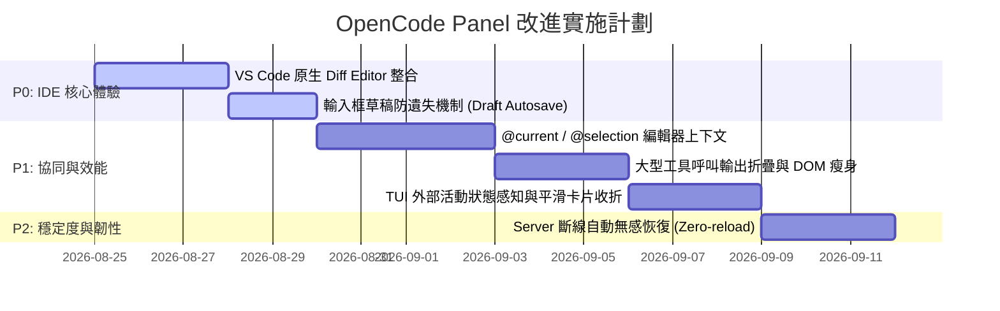

# OpenCode Panel 架構評估與未來改進分析報告

> **專案名稱**：OpenCode Panel (VS Code Extension)  
> **評估日期**：2026-08-21  
> **核心主題**：現有架構合理性分析、TUI/Server 協同機制、體驗與效能優化藍圖

---

## 目錄
1. [現有架構深度分析與合理性評估](#一現有架構深度分析與合理性評估)
2. [與 OpenCode CLI / TUI 的協同與邊界](#二與-opencode-cli--tui-的協同與邊界)
3. [核心改進維度與技術方案](#三核心改進維度與技術方案)
   - [1. IDE 深度整合與編輯器聯動](#1-ide-深度整合與編輯器聯動優先級-p0)
   - [2. 多端協同與狀態一致性](#2-多端協同與狀態一致性優先級-p1)
   - [3. 訊息串流與虛擬滾動效能](#3-訊息串流與虛擬滾動效能優先級-p1)
   - [4. 連線韌性與離線保護](#4-連線韌性與離線保護優先級-p2)
4. [建議實施路線圖 (Roadmap)](#四建議實施路線圖-roadmap)

---

## 一、現有架構深度分析與合理性評估

### 1.1 目前的系統拓撲

```
┌─────────────────────────────────────────────────────────┐
│                      使用者互動層                          │
│  ┌───────────────────────┐    ┌──────────────────────┐  │
│  │ OpenCode TUI (終端機) │    │  VS Code Panel (UI)  │  │
│  └───────────┬───────────┘    └──────────┬───────────┘  │
└──────────────┼───────────────────────────┼──────────────┘
               │ (HTTP / SSE)              │ (HTTP / SSE)
               ▼                           ▼
┌─────────────────────────────────────────────────────────┐
│              OpenCode 本地伺服器核心 (Server)              │
│  - Session 管理與短期/長期對話記憶 (History & Memory)       │
│  - System Prompt 組裝與上下文工程 (Context Engineering)    │
│  - LLM 請求派發 (OpenAI / Anthropic / Gemini / Local LLM)│
│  - 工具呼叫引擎 (Bash, File Read/Write, MCP Tools)        │
│  - 權限管理系統 (Permission Engine & Ruleset)             │
└─────────────────────────────────────────────────────────┘
```

### 1.2 現有架構的三大核心優勢
1. **單一大腦原則（Single Source of Truth）**：
   - 擴充套件**完全不自行實作 Agent 引擎或重複呼叫 LLM API**，而是透過 OpenCode Server 的 `POST /session/:id/prompt_async` 發送請求。
   - 所有記憶、對話、檔案操作的權限與變更，皆由 OpenCode Server 集中控管。
2. **輕量極速（Ultra Lightweight）**：
   - 擴充套件包體積僅約 **500 KB**，啟動時間小於 50ms，完全不佔用額外 Node/Python 行程資源。
3. **無痛跟隨官方升級（Zero-overhead Server Upgrades）**：
   - 當 OpenCode 核心增加新工具、新模型或 MCP 特性時，擴充套件無須改動核心提示詞，天然繼承新能力。

> **結論**：目前的「前後端解耦、Server 作為單一真理來源」架構**完全正確且符合現代 AI 工具（如 Cursor、Windsurf）的最佳實踐**。

---

## 二、與 OpenCode CLI / TUI 的協同與邊界

| 比較項目 | OpenCode TUI (終端機) | OpenCode Panel (VS Code 擴充套件) |
| :--- | :--- | :--- |
| **主要定位** | 快速終端操作、純鍵盤沉浸工作流 | 視覺化對話、IDE 原生檔案比對與編輯器深度整合 |
| **記憶/工作階段** | 共享相同的 SQLite / JSON Session 儲存庫 | 共享相同的 SQLite / JSON Session 儲存庫 |
| **狀態感知方式** | 直接於命令列輸出 | 透過 SSE (`/event`) 即時串流 Delta Batch |
| **獨家能力** | 原生 PTY 終端交互、直接系統指令 | 富文本 Markdown、一鍵開啟檔案/Diff、可視化卡片 |

---

## 三、核心改進維度與技術方案

---

### 1. IDE 深度整合與編輯器聯動（優先級：🔥 P0）

#### 1.1 VS Code 原生雙欄 Diff Editor 整合
- **現狀**：目前點擊 SessionDock 內的修改檔案時，僅呼叫一般檔案開啟。
- **改進方案**：
  - 當工具產生檔案變更時，透過 VS Code 提供的 `vscode.diff` 指令開啟左右比對視窗：
    ```ts
    vscode.commands.executeCommand(
      'vscode.diff',
      originalFileUri, // 修改前快照或磁碟原版
      modifiedFileUri, // 修改後檔案
      `${fileName} (OpenCode Diff)`
    );
    ```
- **預期效果**：使用者可在 VS Code 原生介面中進行逐行審查（Review）、局部接受或拒絕修改。

#### 1.2 智慧上下文引用（@files, @selection, @problems）
- **現狀**：需手動輸入檔案路徑或透過基本 Mention 標註。
- **改進方案**：
  - 支援 `@current`：自動帶入當前游標所在檔案與行號。
  - 支援 `@selection`：自動帶入當前編輯器反白選取的程式碼區塊。
  - 支援 `@problems`：自動抓取當前工作區的 ESLint / TypeScript 診斷錯誤作為 Prompt 上下文。

---

### 2. 多端協同與狀態一致性（優先級：⚡ P1）

#### 2.1 外部操作狀態感知與指示
- **現狀**：若使用者在 TUI 執行任務，Panel 雖會收到事件並更新訊息，但使用者可能不知道背景正在運作。
- **改進方案**：
  - 監聽 `session.idle` / `session.busy` 狀態，在 Panel 頂部顯示「TUI 終端機正在產生回應中…」之提示徽章。
  - 外部在 TUI 按下同意權限時，Panel 的 `PermissionCard` 即時切換為「已於終端機核准」並平滑收折。

#### 2.2 Session Auto 狀態與設定熱同步
- **現狀**：先前 Auto 模式存於 local，現已改為直接查詢 Server 的權限規則庫。
- **改進方案**：
  - 將其推廣至所有 Session 級別的設定（如代理人模式 Agent Mode、溫度參數等），徹底避免客戶端快取過期問題。

---

### 3. 訊息串流與虛擬滾動效能（優先級：⚡ P1）

#### 3.1 虛擬滾動（Virtuoso）高度穩定化
- **現狀**：大型 Markdown 程式碼區塊（Code Block）在生成或折疊時，可能造成滾動視窗微幅抖動。
- **改進方案**：
  - 為工具輸出（Tool Output）與程式碼塊設定穩定的最小高度與 `contain: content`。
  - 工具呼叫輸出超過 80 行時預設截斷，提供「展開更多日誌」按鈕，大幅降低 DOM 節點數量。

#### 3.2 頂部固定問題列（StickyPromptBar）對齊優化
- **現狀**：已完成 6px 滾動條邊距修正，寬度已精確對齊。
- **改進方案**：
  - 加入平滑淡入淡出（Opacity Transition），讓使用者滾動超過目前問題時，置頂列無縫浮現。

---

### 4. 連線韌性與離線保護（優先級：☕ P2）

#### 4.1 輸入框草稿防遺失（Draft Autosave）
- **現狀**：若在輸入框打了長篇 Prompt 卻意外切換 Session 或關閉分頁，文字可能遺失。
- **改進方案**：
  - 在 `Composer.tsx` 中加入依 `sessionId` 索引的 `sessionStorage` 草稿快取，切換工作階段時即時保存與還原。

#### 4.2 Server 重啟後的無聲恢復（Zero-reload Recovery）
- **現狀**：Server 若異常重啟，SSE 斷線需等候輪詢重連。
- **改進方案**：
  - `eventBridge.ts` 偵測到 Server 重新上線後，自動背景觸發 `resync` 並無聲刷新當前 Session，無需使用者手動 Reload Webview。

---

## 四、建議實施路線圖 (Roadmap)



---

### 總結
`opencode-panel` 擁有非常優異的架構基礎（前後端乾淨分離、Server 為單一真理來源）。未來的最佳投入方向是**持續深化 VS Code 編輯器層級的專屬體驗（Diff 檢視、智慧上下文、流暢動畫）**，讓它與 TUI 形成完美的「雙劍合璧」開發體驗！
